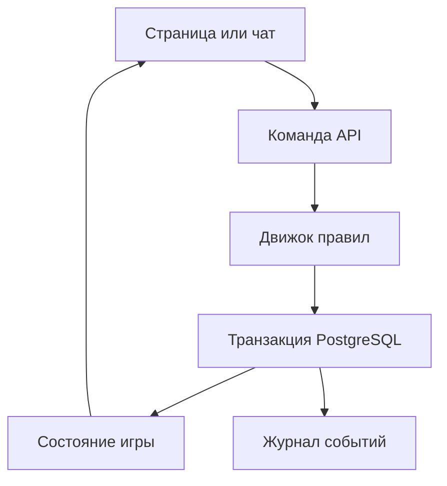

# Логика и зависимости

## Главный принцип

Интерфейс не изменяет HP, задания или предметы напрямую. Команда поступает в API, движок правил проверяет её, транзакция изменяет проекции данных и записывает неизменяемое событие. После ответа интерфейс получает новое состояние.

## Зависимости страниц

| Страница | Читает | Создаёт команды | Что обновляет |
|---|---|---|---|
| Чат | сцена, сообщения, герой, партия, локация | действие, бросок, предмет, заметка | события, журнал, герой, мир |
| Персонажи | листы, ресурсы, эффекты | развитие, отдых, экипировка | характеристики, способности, инвентарь |
| Карта | локации, маршруты, знания | переход, метка | текущая сцена, открытия, путешествие |
| Задания | задания и цели | принять, отказаться, сдать | статус, награды, журнал |
| Журнал | события и заметки | заметка, тег | личные записи |
| Бестиарий | знания героя | изучить, проверить | доступные факты о существе |
| Предметы | инвентарь и открытия | использовать, опознать, передать | количество, заряды, эффекты, знания |
| Справочник | правила | поиск | ничего игрового |

## Границы данных

- `secret_data` существа и неоткрытые свойства предметов доступны только серверному движку и мастеру.
- Клиент получает свойства предмета только через `item_discoveries`, а существ — через `knowledge_entries`.
- Все записи принадлежат кампании; доступ проверяется через `campaign_members`.
- Производные показатели вычисляются из первичных данных, а не хранятся в нескольких местах.
